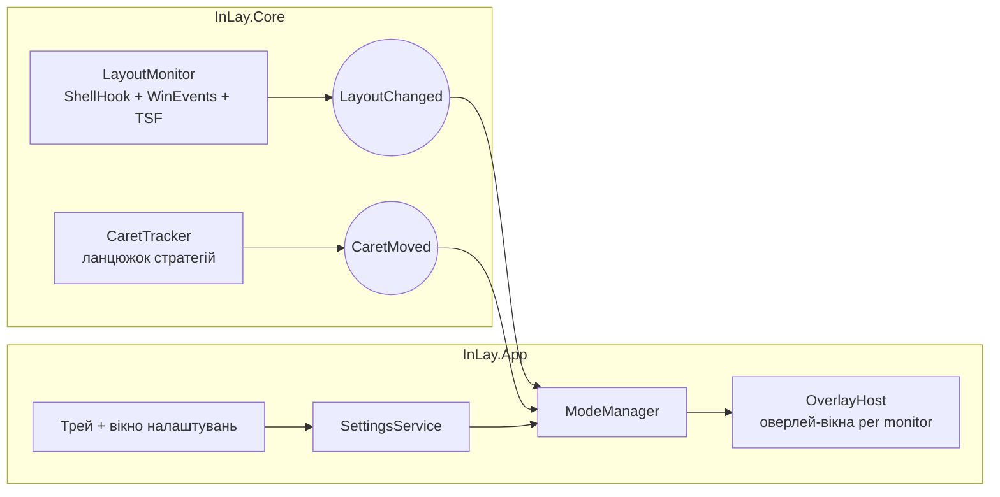

# InLay — технічний план і план реалізації

*Версія 0.1 · липень 2026 · робочий документ (для публічного репозиторію згодом перекласти англійською)*

---

## 1. Бачення продукту

**Проблема.** На Windows немає зручного способу бачити поточну мову вводу там, куди дивишся — біля текстового курсора. Індикатор у треї далеко від очей, а існуючі сторонні рішення (Aml Maple, EveryLang тощо) або застарілі, або перевантажені зайвим функціоналом, або платні без відкритого коду. На macOS така поведінка вбудована — InLay переносить її на Windows і робить краще.

**Рішення.** InLay — легка фонова утиліта, яка показує індикатор поточної розкладки в момент перемикання. Ключовий диференціатор — **система режимів відображення**: користувач сам обирає, *як* саме бачити мову — маленький бейдж біля каретки, велика плашка по центру екрана, підсвітка краю монітора, постійний HUD у куті тощо. Це не просто «тема», а різні підходи до індикації, які можна перемикати й комбінувати.

**Принципи.** Нульове відчутне навантаження на систему; жодних клавіатурних хуків і телеметрії; дизайн і UX на рівні PowerToys; відкритий код як основа довіри та зростання.

**Аудиторія.** Усі, хто друкує двома і більше мовами: розробники, перекладачі, білінгвальні користувачі. Спільнота PowerToys/winget — природний перший канал дистрибуції.

---

## 2. Технологічний стек

| Компонент | Вибір | Обґрунтування |
|---|---|---|
| Runtime | **.NET 10 LTS** | Актуальний LTS (підтримка до листопада 2028), сучасний C# 14, надійна база для розвитку в .NET-напрямку |
| UI-фреймворк | **WPF** | Єдиний варіант із зрілою підтримкою прозорих click-through оверлеїв (`AllowsTransparency` + Win32 extended styles). WinUI 3 відкинуто: прозорість і non-activating вікна там досі болючі |
| Дизайн-бібліотека | **WPF-UI (lepo.co)** | Fluent 2, Mica, `FluentWindow`, `NavigationView` — вигляд «як PowerToys» у чистому WPF |
| P/Invoke | **Microsoft.Windows.CsWin32** | Source-generated обгортки з `NativeMethods.txt`: типобезпечно, без ручних сигнатур |
| Композиція | **.NET Generic Host** | DI, конфігурація, lifecycle, hosted services — індустріальний патерн, корисний для кар'єрного розвитку |
| MVVM | **CommunityToolkit.Mvvm** | Source generators (`[ObservableProperty]`, `[RelayCommand]`), мінімум boilerplate |
| Трей | **H.NotifyIcon.Wpf** | Сучасна підтримка tray icon, efficiency mode |
| Логування | **Serilog** | Файловий sink у `%LOCALAPPDATA%\InLay\logs`, rolling, рівень з налаштувань |
| Тести | **xUnit** (+ FluentAssertions) | Стандарт де-факто |
| Дистрибуція | **Velopack** (GitHub/winget) + **MSIX** (Store) | Velopack: делта-автооновлення поза Store; MSIX — для платного каналу в Microsoft Store |
| CI/CD | **GitHub Actions** | build → test → sign → release → winget-releaser |

---

## 3. Архітектура рішення

```
InLay.sln
├─ src/
│  ├─ InLay.Core/       # двигун без UI-залежностей: моніторинг розкладки,
│  │                    # трекінг каретки, моделі, налаштування
│  ├─ InLay.App/        # WPF: хост, оверлеї, вікно налаштувань, трей
│  └─ InLay.Diag/       # (опційно) консольна діагностика двигуна — див. §10
├─ tests/
│  └─ InLay.Tests/      # xUnit: юніт-тести Core
└─ docs/
```

Потік подій — строго в один бік: двигун публікує події, режими індикації на них реагують, хост оверлеїв малює.



`InLay.Core` не знає про WPF взагалі — це дозволяє тестувати логіку без UI і, за потреби, перевикористати двигун (CLI-діагностика, майбутні клієнти).

---

## 4. Ключові підсистеми

### 4.1 Детектор перемикання розкладки (`LayoutMonitor`)

Подієво, без активного опитування:

1. **`RegisterShellHookWindow` + повідомлення `HSHELL_LANGUAGE`** — системне сповіщення про зміну мови у foreground-вікні. Основне джерело.
2. **`SetWinEventHook(EVENT_SYSTEM_FOREGROUND, EVENT_OBJECT_FOCUS)`** — при зміні фокуса перечитуємо розкладку нового вікна: `GetKeyboardLayout(GetWindowThreadProcessId(GetForegroundWindow()))`. Різні вікна мають різні активні розкладки — це треба відстежувати.
3. **TSF (`ITfInputProcessorProfileMgr` + `ITfInputProcessorProfileActivationSink`)** — додатковий шар для IME-профілів (японська/китайська/корейська) і сторонніх Text Input Processors, де HKL сам по собі не розрізняє режими.
4. **Резервний polling 4–6 Гц** — лише як safety net для вікон, що поводяться нестандартно (деякі консольні/UWP хости); вмикається адаптивно.

Мапінг `HKL → підпис`: `LANGID = LOWORD(HKL)` → `LCIDToLocaleName` → ISO-код → підпис користувача (за замовчуванням дволітерні `UK`/`EN`; повністю кастомізується — див. §5). Важливий нюанс Windows: **emoji-прапори не рендеряться** (показуються як літери «UA»), тому візуальна ідентифікація мови будується на кольорах і тексті, не на прапорцях.

### 4.2 Локатор каретки (`CaretTracker`) — ланцюжок стратегій

Каретка в різних застосунках живе по-різному, тому — Strategy pattern з пріоритезованим ланцюжком і кешем «яка стратегія спрацювала для цього процесу»:

1. **`GetGUIThreadInfo` → `rcCaret` + `hwndCaret`** (`ClientToScreen`). Покриває класичні Win32-контроли: Notepad, WinForms, діалоги, rename-поле Провідника. Швидко й дешево. *Не працює* там, де застосунок малює каретку сам (WPF, Chromium, Electron, Firefox, Office).
2. **`SetWinEventHook(EVENT_OBJECT_LOCATIONCHANGE, idObject == OBJID_CARET)`** + `IAccessible::accLocation` — подієве відстеження положення каретки. Покриває більшість застосунків, включно з Chromium після активації accessibility. `WINEVENT_OUTOFCONTEXT` — без DLL-ін'єкцій (менше проблем з антивірусами).
3. **UI Automation**: focused element → **`TextPattern2.GetCaretRange()`** → `GetBoundingRectangles()`; якщо TextPattern2 недоступний — `TextPattern.GetSelection()` з розширенням degenerate range на один символ. Це основний шлях для Chromium/Electron/сучасного Office; саме підключення UIA-клієнта «будить» дерево акцесибіліті Chromium (робити ліниво, кешувати — див. §11).
4. **Фолбек без каретки**: якщо позицію знайти не вдалося (гра, елевейтед вікно, екзотичний рендеринг) — ModeManager перемикається на фолбек-подання: бейдж біля курсора миші (`GetCursorPos`) або режим без прив'язки (splash/кут).

Координати всюди — фізичні пікселі; переведення в DIP і позиціонування описано нижче.

### 4.3 Оверлей-рендерер (`OverlayHost`)

- WPF-вікно: `WindowStyle=None`, `AllowsTransparency=True`, `Background=Transparent`, `Topmost=True`, `ShowActivated=False`, `ShowInTaskbar=False`.
- На `SourceInitialized` через CsWin32: `GWL_EXSTYLE |= WS_EX_LAYERED | WS_EX_TRANSPARENT | WS_EX_NOACTIVATE | WS_EX_TOOLWINDOW` — вікно повністю click-through, ніколи не забирає фокус і не з'являється в Alt-Tab.
- **DPI — першорядна вимога**: маніфест `PerMonitorV2`; позиціонування виконуємо через `SetWindowPos` у *фізичних* пікселях (координати з Win32 API), масштаб контенту — з `GetDpiForMonitor`. Так уникаємо округлень WPF при переносі між моніторами з різним масштабом.
- Пул вікон: по одному оверлею на монітор для повноекранних режимів (splash, glow); одне «плавуче» вікно для бейджа.
- Автоприховування в повноекранних застосунках: `SHQueryUserNotificationState` (`QUNS_RUNNING_D3D_FULL_SCREEN`, `QUNS_BUSY`) + список винятків користувача.
- Анімації — WPF Storyboard (fade/scale), тривалості з налаштувань; для постійних режимів анімації мінімальні, щоб не палити GPU.

### 4.4 Система режимів індикатора — головна фіча

Абстракція, навколо якої будується вся «фішка перемикання дизайну»:

```csharp
public interface IIndicatorMode
{
    string Id { get; }                       // "caret-badge", "splash", ...
    IndicatorTraits Traits { get; }          // NeedsCaret | Persistent | Transient | PerMonitor
    void OnLayoutChanged(LayoutInfo layout, CaretInfo? caret);
    void OnCaretMoved(CaretInfo caret);      // лише для «липких» режимів
    void Deactivate();
}
```

Стартовий набір режимів:

| Режим | Поведінка | Коли доречний |
|---|---|---|
| **CaretBadge** *(за замовчуванням)* | Компактна плашка біля каретки; підрежими: «показати на N мс після перемикання» або «слідкувати постійно» | Основний сценарій, аналог macOS |
| **FullScreenSplash** | Велика напівпрозора плашка по центру активного монітора, fade in/out ~700 мс | Коли важлива помітність; працює навіть без каретки |
| **CursorBadge** | Бейдж біля курсора миші | Автофолбек, коли каретку не знайдено |
| **CornerHud** | Постійний «pill» у вибраному куті монітора | Хто хоче бачити мову завжди |
| **BorderGlow** | Тонка кольорова смуга по краю екрана; колір = мова | Периферійний зір, аксесибіліті; реалізація — 4 вузькі вікна, не fullscreen |
| **TrayOnly** | Лише гліф/колір іконки в треї | Мінімалізм |

`ModeManager` дозволяє **комбінувати**: один *перехідний* режим (реакція на перемикання) + опційно один *постійний* (HUD/glow). Кожен режим має власну секцію конфігурації; додавання нового режиму = новий клас + реєстрація в DI, без змін решти системи. Це відкриває шлях до «галереї режимів» від спільноти в майбутньому.

**Стилі per-language**: для кожної розкладки — колір фону/тексту, підпис (`UK`, `УКР`, `🇺🇦`-текстова заміна, будь-який рядок), пресети з коробки. Саме колірне кодування мов компенсує відсутність emoji-прапорів на Windows.

---

## 5. Дизайн-система у стилі PowerToys

**Вікно налаштувань** — `FluentWindow` (WPF-UI) з Mica на Win11, `NavigationView` зліва, картки налаштувань у стилі Windows 11 Settings:

- **Загальні** — автозапуск, мова інтерфейсу, оновлення;
- **Індикатор** — вибір і комбінування режимів, тривалість, анімація, **live-превʼю** (панель, що програє демо індикатора при кожній зміні налаштування — сильний UX-хід у дусі PowerToys);
- **Мови** — список встановлених розкладок, підпис і кольори кожної;
- **Поведінка** — винятки застосунків, повноекранний режим, елевейтед-вікна;
- **Про застосунок** — версія, ліцензія, посилання.

Світла/темна теми + системний accent color; типографіка Segoe UI Variable. **Оверлей**: заокруглений pill, легка тінь, стримані анімації — «системний» вигляд, ніби фіча самої Windows.

**Трей**: лівий клік — вкл/викл або швидке меню режимів; правий — контекстне меню (Налаштування, Пауза, Вихід). Локалізація UI з першого дня: `en` + `uk` (resx).

---

## 6. Налаштування і стан

`%LOCALAPPDATA%\InLay\settings.json` — System.Text.Json із source-generated контекстом (AOT-friendly, швидкий старт). Запис атомарний (temp-файл + replace). Єдиний писар — сам застосунок, тож без FileSystemWatcher: простий `SettingsService` з подією `Changed`, на яку підписані ModeManager і UI. Версіонування схеми (`"schemaVersion": 1`) + міграції.

Автозапуск: `HKCU\...\Run` для Velopack-збірки, `StartupTask` для MSIX. Single-instance через named `Mutex` (повторний запуск відкриває налаштування наявного). Перший запуск — короткий онбординг: вибір режиму з живим превʼю.

---

## 7. Продуктивність і якість

Бюджети, які тримаємо як контракт:

- **CPU у простої ≈ 0%** — усе подієве; резервний polling ≤ 6 Гц і лише коли активний;
- **затримка** від перемикання до появи індикатора **< 80 мс**;
- **RAM** — цілимось у 60–100 МБ (реалістично для WPF); ReadyToRun для швидкого старту;
- жодних `WH_KEYBOARD_LL` та DLL-ін'єкцій — і для затримок вводу, і для репутації в антивірусів;
- події каретки коалесуються (не частіше кадру) — без GC-тиску в гарячому шляху.

**Матриця ручного тестування** (автотести UIA нестабільні, тому Core — юніт-тестами, інтеграція — чеклістом):

| Категорія | Цілі |
|---|---|
| Класика Win32 | Notepad, WordPad, rename у Провіднику, діалоги |
| Chromium/Electron | Chrome, Edge, VS Code, Telegram Desktop, Slack |
| Інший рендеринг | Firefox, Word/Excel, Windows Terminal, WPF-застосунки |
| Системне | UWP (Параметри), RDP-вікно, елевейтед Regedit |
| Монітори | 100%+150%+200%, hot-plug зовнішнього монітора, різні primary |
| IME | японська (режими IME через TSF) |

---

## 8. Дистрибуція, підпис, оновлення

- **GitHub Releases + Velopack** — безкоштовний канал з делта-автооновленнями; **winget** маніфест (автоматизація через winget-releaser) — must-have для цільової аудиторії.
- **Microsoft Store (MSIX)** — другий канал; за потреби — платний (див. §10). Store дає довіру, автооновлення і видимість.
- **Підпис коду** — обов'язковий проти SmartScreen: Azure Trusted Signing (~$10/міс; перевірити актуальні умови для індивідуальних розробників) або OV-сертифікат.
- CI/CD: GitHub Actions — build, тести, підпис, реліз, публікація manifest'ів. Reproducible builds як довгострокова ціль (важливо для довіри до утиліти, що «бачить» увесь ввід — хоч ми і не читаємо клавіші, прозорість знімає питання).

---

## 9. Дорожня карта

Оцінки — для одного розробника у вечірньому темпі.

| Етап | Обсяг | Оцінка |
|---|---|---|
| **M0 — Скелет** | Solution по §3, Generic Host + DI, трей, Serilog, single-instance, автозапуск, заготовка click-through вікна | 3–5 днів |
| **M1 — MVP** | LayoutMonitor (shell hook + focus events) + режими **FullScreenSplash** і **CornerHud**. Свідомо *без* каретки — продукт уже корисний і його можна показувати | 1–1.5 тиж |
| **M2 — Каретка v1** | `GetGUIThreadInfo` + WinEvent `OBJID_CARET`, режим **CaretBadge**, фолбек CursorBadge | 1–2 тиж |
| **M3 — Каретка v2** | UIA `TextPattern2.GetCaretRange` (Chromium/Electron), кеш стратегій per-process, мультимонітор + DPI-матриця | 1–2 тиж |
| **M4 — Режими і налаштування** | ModeManager, комбінування режимів, вікно налаштувань WPF-UI з live-превʼю, BorderGlow, per-language стилі | 2–3 тиж |
| **M5 — Полірування** | Анімації, теми, локалізація en/uk, онбординг, винятки застосунків, fullscreen-детект | 1–2 тиж |
| **M6 — Дистрибуція** | Velopack, підпис, winget, CI/CD, краш-репорти (локальні лог-бандли) | 1 тиж |
| **M7 — Реліз 1.0** | README з GIF-демо, лендінг, Store-листинг, анонси (r/Windows, X, Show HN, PowerToys-спільнота) | 1 тиж |

Разом ≈ **2.5–3.5 місяці** до 1.0. Після M1 кожен етап закінчується робочим інкрементом — можна публікувати pre-release'и й збирати фідбек рано.

---

## 10. Ліцензія та монетизація

> **Рішення (фінальне, липень 2026).** InLay — повністю відкритий код, **MIT на весь репозиторій** (кореневий `LICENSE` лишається без змін). Обрана модель — **«Full MIT + donations (GitHub Sponsors) + trademark»** (модель **A** нижче): жодного платного чи source-available каналу, дохід — виключно добровільні донати (GitHub Sponsors / Ko-fi), єдиний важіль захисту — торгова марка на назву й лого. Аналіз нижче лишаємо як обґрунтування вибору; альтернативи **B–E** (Mole-гібрид, dual licensing, FSL, PolyForm) більше не розглядаються. CLA лишається рекомендованим — див. нижче.

### Вихідне обмеження, яке треба прийняти чесно

Якщо код під справжньою open-source ліцензією (MIT, GPL, AGPL — будь-якою OSI-схваленою), **будь-хто може легально зібрати й роздавати його безкоштовно**. «Продавати ліцензії» на такий код у лоб неможливо — продають щось поруч: зручність, бренд, закриту частину, або виключення з copyleft. Хто хоче саме продавати ліцензії на сам код — іде в *source-available* (це вже формально не open source, хоч код і відкритий для читання).

### Як насправді влаштована модель Mole

Mole (tw93/Mole, ~50k+ зірок) — це **не** «open source, який продає сам себе». Модель двокомпонентна: CLI-двигун — безкоштовний, відкритий, MIT; а нативний Mac-застосунок — окремий платний продукт ($19 one-time, license key, lifetime updates, оплата через merchant-of-record Dodo Payments). Тобто відкрите ядро будує спільноту і зірки, а гроші приносить платний GUI поверх нього.

**Важливий урок з того ж кейсу**: спільнота вже зробила Burrow — *безкоштовний open-source GUI* поверх відкритого двигуна Mole. Це головний ризик open-core: якщо вся цінність — у UI, а двигун відкритий, хтось збере безкоштовну альтернативу твоєму платному застосунку. Для InLay це критично, бо **наша цінність — саме в оверлеї та режимах**, а не в «двигуні».

### Порівняння моделей для InLay

| Модель | Це OSI open source? | Як заробляєш | Захист від безкоштовних клонів | Приклад | Головний ризик |
|---|---|---|---|---|---|
| **A. Повний MIT + платні канали** | Так | Платний Microsoft Store (зручність, автооновлення) + безкоштовний GitHub/winget + GitHub Sponsors | Лише бренд (trademark) | **Files** (файловий менеджер: повністю відкритий, просить купити в Store або підтримати на GitHub) | Дохід скромний; клони легальні |
| **B. Модель Mole (відкритий двигун + платний застосунок)** | Ядро — так | Продаж ліцензій на застосунок ($10–15 one-time) | Середній: код застосунку закритий/захищений | Mole | «Ефект Burrow»: безкоштовний GUI від спільноти |
| **C. Dual licensing (AGPL + комерційна)** | Так | Компанії, що не можуть жити з AGPL, купують комерційну ліцензію | Клони зобов'язані бути AGPL | Qt, MySQL | Для консюмерської утиліти комерційний попит ≈ нуль; потрібен CLA з першого дня |
| **D. Source-available: FSL-1.1** | Ні (але код повністю відкритий для читання/форків у некомерційних межах; кожна версія через 2 роки автоматично стає MIT/Apache) | Прямий продаж ліцензій, free for personal — на твій вибір | Сильний: конкурентне комерційне використання заборонено | Sentry | Частина спільноти не вважає це «справжнім» open source; менше зірко-ентузіазму |
| **E. PolyForm Noncommercial / власна EULA** | Ні | «Безкоштовно особисто, платно комерційно» | Сильний | Багато інді-інструментів | Ті ж репутаційні мінуси + самостійний enforcement |

### Обрана модель і що робимо

**Ліцензія — MIT на весь репозиторій, назавжди.** Це максимізує головне на цьому етапі — зірки, winget, згадки, контриб'юторів, репутацію. PowerToys-аудиторія любить MIT. Опубліковані під MIT версії відкликати все одно неможливо; свідомо лишаємо весь код вільним і надалі.

**Дохід — добровільні донати.** GitHub Sponsors + Ko-fi, без платного застосунку, Store-листингу чи license key. Клони при цьому легальні — приймаємо це свідомо; захист будуємо на бренді, а не на ліцензії.

**CLA — рекомендований, з першого ж зовнішнього PR** (наприклад, cla-assistant), за зразком PowerToys (MIT + CLA). Це страховка і гнучкість: чіткий провенанс внесків і свобода коригувати умови в майбутньому, якщо колись знадобиться. Ставимо його заздалегідь, бо без підписаних CLA будь-яка зміна умов пізніше вимагала б згоди кожного контриб'ютора.

**Практика для обраної моделі:**

- **Trademark на «InLay» + лого** — тепер головний і єдиний важіль (модель Files/Firefox/VS Code): код вільний, бренд — ні. Спершу перевірити зайнятість імені у своїх юрисдикціях і в Store.
- **Донати не потребують merchant of record чи валідації ліцензій** — GitHub Sponsors / Ko-fi самі опрацьовують платежі й податки. Жодних license key, ed25519-ключів чи телеметрії; це узгоджується з принципом «довіра — частина продукту». (Якщо колись зʼявиться платний канал — повертаємось до MoR на кшталт Paddle / Lemon Squeezy / Dodo Payments.)

---

## 11. Ризики та відкриті питання

- **Елевейтед вікна**: без прав UIA/події до них недоступні (UIPI) → автофолбек на CursorBadge/Splash; опція «запускати від імені адміністратора»; шлях `uiAccess=true` (потребує підпису і встановлення в Program Files) — відкладена опція.
- **Chromium/Electron accessibility**: підключення UIA активує дерево акцесибіліті і може коштувати продуктивності важким Electron-застосункам → ліниве підключення, кеш «робочої» стратегії per-process, винятки користувача.
- **WPF-прозорість на великих поверхнях**: fullscreen-оверлеї з анімацією можуть навантажувати GPU → BorderGlow як 4 вузькі вікна, splash — короткоживучий.
- **Ім'я**: перевірити «InLay» на колізії (Store, trademark-бази) до релізу.
- **SmartScreen/антивіруси**: вирішується підписом і відсутністю хуків клавіатури.
- Secure desktop (UAC-запит) недосяжний для оверлеїв — прийнятне обмеження, задокументувати.

---

## 12. Найближчі кроки

1. Зафіксувати рішення по §10 (мінімум: лишаємо MIT + вмикаємо CLA-бота з першого зовнішнього PR).
2. Згенерувати скелет M0: solution, Generic Host + DI, трей, Serilog, single-instance, клас click-through overlay-вікна з правильними extended styles і DPI-обробкою.
3. M1: LayoutMonitor + FullScreenSplash — перший інкремент, який уже можна показати світу.
