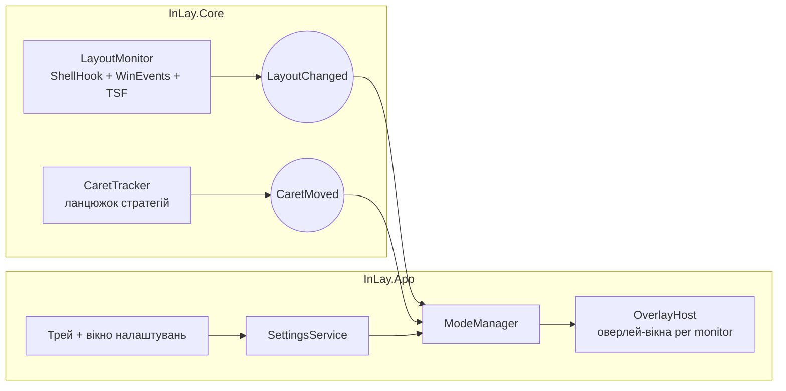

# InLay — технічний план і план реалізації

*Версія 0.2 · липень 2026 · робочий документ (для публічного репозиторію згодом перекласти англійською)*

> **Що змінилося у 0.2.** Напрямок зафіксовано остаточно: **InLay — повністю відкритий (MIT на весь репозиторій) і безкоштовний назавжди; розвиток фінансується добровільними донатами** (Buy Me a Coffee + GitHub Sponsors). Розділ §10 переписано з нуля, порівняльні таблиці моделей монетизації з v0.1 вилучено — рішення ухвалене. §2 доповнено ліцензійним аудитом залежностей (FluentAssertions → AwesomeAssertions). §8 більше не містить платного Store-каналу. §9 відображає фактичний стан: **M0 і M1 завершені**.

---

## 1. Бачення продукту

**Проблема.** На Windows немає зручного способу бачити поточну мову вводу там, куди дивишся — біля текстового курсора. Індикатор у треї далеко від очей, а існуючі сторонні рішення (Aml Maple, EveryLang тощо) або застарілі, або перевантажені зайвим функціоналом, або платні без відкритого коду. На macOS така поведінка вбудована — InLay переносить її на Windows і робить краще.

**Рішення.** InLay — легка фонова утиліта, яка показує індикатор поточної розкладки в момент перемикання. Ключовий диференціатор — **система режимів відображення**: користувач сам обирає, *як* саме бачити мову — маленький бейдж біля каретки чи велика плашка по центру екрана. Це не просто «тема», а різні підходи до індикації. Усі вони транзієнтні (короткий сигнал у момент перемикання, як на macOS) — постійних елементів на екрані InLay не тримає.

**Принципи.** Нульове відчутне навантаження на систему; жодних клавіатурних хуків і телеметрії; дизайн і UX на рівні PowerToys; **повністю відкритий код і безкоштовність — назавжди**. Для утиліти, що живе поруч із вводом, прозорість — не маркетинг, а частина продукту; монетизація зведена до добровільних донатів (§10), щоб жоден комерційний механізм не тиснув на UX і довіру.

**Аудиторія.** Усі, хто друкує двома і більше мовами: розробники, перекладачі, білінгвальні користувачі. Спільнота PowerToys/winget — природний перший канал дистрибуції.

---

## 2. Технологічний стек і ліцензії залежностей

**Політика залежностей:** лише permissive-ліцензії — **MIT / Apache-2.0 / BSD**. Ліцензія перевіряється перед додаванням пакета **і повторно при кожному мажорному оновленні**: кейс FluentAssertions (з v8 — комерційна ліцензія Xceed) довів, що ліцензія може змінитися між версіями. Пакети з «free for non-commercial» чи іншими обмеженнями — блокер незалежно від зручності.

| Компонент | Вибір | Ліцензія | Обґрунтування |
|---|---|---|---|
| Runtime | **.NET 10 LTS** | MIT | Актуальний LTS (підтримка до листопада 2028), сучасний C# 14, надійна база для розвитку в .NET-напрямку |
| UI-фреймворк | **WPF** | MIT | Єдиний варіант із зрілою підтримкою прозорих click-through оверлеїв (`AllowsTransparency` + Win32 extended styles). WinUI 3 відкинуто: прозорість і non-activating вікна там досі болючі |
| Дизайн-бібліотека | **WPF-UI (lepo.co)** | MIT | Fluent 2, Mica, `FluentWindow`, `NavigationView` — вигляд «як PowerToys» у чистому WPF |
| P/Invoke | **Microsoft.Windows.CsWin32** | MIT | Source-generated обгортки з `NativeMethods.txt`: типобезпечно, без ручних сигнатур. Build-time генератор (`PrivateAssets=all`), тому припустимий і в `Core` — це не UI-залежність |
| Композиція | **.NET Generic Host** | MIT | DI, конфігурація, lifecycle, hosted services — індустріальний патерн, корисний для кар'єрного розвитку |
| MVVM | **CommunityToolkit.Mvvm** | MIT | Source generators (`[ObservableProperty]`, `[RelayCommand]`), мінімум boilerplate |
| Трей | **H.NotifyIcon.Wpf** | MIT | Сучасна підтримка tray icon, efficiency mode |
| Логування | **Serilog** | Apache-2.0 | Файловий sink у `%LOCALAPPDATA%\InLay\logs`, rolling, рівень з налаштувань |
| Тести | **xUnit + AwesomeAssertions** | Apache-2.0 | AwesomeAssertions — Apache-2.0-форк FluentAssertions 7.x; сам FluentAssertions з v8 перейшов під платну ліцензію і заборонений політикою вище |
| Дистрибуція | **Velopack** (GitHub/winget), опційно MSIX | MIT | Делта-автооновлення поза Store; Store — лише як безкоштовний канал видимості (див. §8, §10) |
| CI/CD | **GitHub Actions** | — | build → test → sign → release → winget-releaser |

### Аудит поточних пакетів (Directory.Packages.props; ліцензії звірено з LICENSE-файлами репозиторіїв, липень 2026)

| Пакет | Версія | Ліцензія | Статус |
|---|---|---|---|
| Microsoft.Extensions.Hosting | 10.0.9 | MIT | ✅ |
| CommunityToolkit.Mvvm | 8.4.2 | MIT | ✅ |
| WPF-UI | 4.3.0 | MIT | ✅ |
| H.NotifyIcon.Wpf | 2.4.1 | MIT | ✅ (upstream Hardcodet.NotifyIcon.Wpf теж MIT — спадщина чиста) |
| Microsoft.Windows.CsWin32 | 0.3.298 | MIT | ✅ build-time only, у бінарник не потрапляє |
| Serilog | 4.3.1 | Apache-2.0 | ✅ |
| Serilog.Extensions.Hosting | 10.0.0 | Apache-2.0 | ✅ |
| Serilog.Settings.Configuration | 10.0.1 | Apache-2.0 | ✅ |
| Serilog.Sinks.File | 7.0.0 | Apache-2.0 | ✅ |
| Microsoft.NET.Test.Sdk | 18.7.0 | MIT | ✅ |
| xunit | 2.9.3 | Apache-2.0 | ✅ |
| xunit.runner.visualstudio | 3.1.5 | Apache-2.0 | ✅ |
| AwesomeAssertions | 9.4.0 | Apache-2.0 | ✅ заміна FluentAssertions — конфлікт усунено |
| coverlet.collector | 10.0.1 | MIT | ✅ |
| Velopack *(план, M6)* | — | MIT | ✅ попередньо перевірено |

**Висновок:** конфліктів немає. Увесь дерево залежностей — MIT/Apache-2.0, повністю сумісне з MIT-ліцензією репозиторію; Apache-2.0-пакети додатково дають патентний захист. Дія на майбутнє: ліцензійна перевірка — обов'язковий пункт при будь-якому бампі мажорної версії (`Directory.Packages.props` централізує версії, тож перевіряти є де).

---

## 3. Архітектура рішення

```
InLay.sln
├─ src/
│  ├─ InLay.Core/       # двигун без UI-залежностей: моніторинг розкладки,
│  │                    # трекінг каретки, моделі, налаштування
│  ├─ InLay.App/        # WPF: хост, оверлеї, вікно налаштувань, трей
│  └─ InLay.Diag/       # (опційно) консольна діагностика двигуна
├─ tests/
│  └─ InLay.Tests/      # xUnit: юніт-тести Core
└─ docs/
```

Потік подій — строго в один бік: двигун публікує події, режими індикації на них реагують, хост оверлеїв малює.



`InLay.Core` не знає про WPF взагалі — це дозволяє тестувати логіку без UI і, за потреби, перевикористати двигун (CLI-діагностика, майбутні клієнти). Зафіксоване уточнення з M1: **CsWin32 живе і в Core** — це source-генератор часу компіляції, а не UI-збірка, тож правило «No UI in Core» не порушується; саме він забезпечує self-contained прихований message pump двигуна.

---

## 4. Ключові підсистеми

### 4.1 Детектор перемикання розкладки (`LayoutMonitor`) — ✅ реалізовано в M1

Подієво, без активного опитування:

1. **Рівний foreground-polling — основне джерело.** `GetForegroundWindow` + `GetKeyboardLayout` кожні ~150 мс. Це виявилося **основним** детектором перемикання, а не резервним: `HSHELL_LANGUAGE` (нижче) на сучасній Windows ненадійний і часто не приходить взагалі (підтверджено на реальній машині — усі перемикання губилися). Виклики копійчані, тож рівний інтервал ≈0% CPU у простої; від адаптивного відкату до ~1 Гц відмовились — він додавав найгіршу затримку саме на повернення-з-простою (найчастіший момент перемикання). Затримка появи індикатора — ~150–200 мс; менше (<80 мс) у фоновому процесі **без клавіатурних хуків недосяжно** — приймається як реалістичне обмеження.
2. **`RegisterShellHookWindow` + `HSHELL_LANGUAGE`** — опортуністичне джерело: коли раптом приходить, це авторитетний in-place switch. Покладатись на нього не можна (див. вище), але коли є — дає миттєвий сигнал.
3. **`SetWinEventHook(EVENT_SYSTEM_FOREGROUND, EVENT_OBJECT_FOCUS)`** — при зміні фокуса перечитуємо розкладку нового вікна: різні вікна мають різні активні розкладки. Реалізовано з **дебаунсом 200 мс** (транзієнтний фокус-шум від меню/таскбара/alt-tab колапсує в одне читання) і **фільтром власного процесу** (фокус на треї/налаштуваннях InLay не породжує хибних спрацювань).
4. **TSF (`ITfInputProcessorProfileActivationSink`) — відкинуто.** Розглядався як надійне низьколатентне джерело, але `ITfThreadMgr` та його sink'и **per-thread за дизайном**: фоновий процес бачить лише профіль власного потоку, не foreground-застосунку. Глобальну координацію робить системний `ctfmon`, недоступний ззовні без DLL-ін'єкції — а вона заборонена політикою (§7). Тож TSF для фонового монітора нежиттєздатний; лишаємось на polling.

Емісії де-дуплікуються за LANGID і пригнічуються під час паузи (`AppState`); на resume двигун ре-емітить поточну розкладку, щоб індикатор одразу оновився без хибного «анонсу».

**Дизайн-контракт (реалізовано):** подія `LayoutChanged` несе поле `reason` — `LayoutSwitch` (реальне in-place перемикання) чи `FocusRefresh` (перечитування при фокусі/старті/resume/poll). Оскільки `HSHELL_LANGUAGE` ненадійний, `LayoutSwitch` визначається **HWND-aware класифікацією**: зміна LANGID під **незмінним** foreground-вікном = реальний switch; інакше — refresh (чиста `ClassifyReason`, під юніт-тестами). Транзієнтні індикатори (Splash, майбутній CaretBadge) реагують лише на `LayoutSwitch`; на `FocusRefresh` мовчать — «ніколи не анонсити через розрив» (старт/resume/фокус синхронізуються тихо).

Мапінг `HKL → підпис`: `LANGID = LOWORD(HKL)` → `LCIDToLocaleName` → BCP-47 → підпис користувача (за замовчуванням дволітерні `UK`/`EN`; повна кастомізація — M4, §5). Реалізовано в `KeyboardLayoutResolver` з чистим (юніт-тестованим) ядром. Важливий нюанс Windows: **emoji-прапори не рендеряться**, тому візуальна ідентифікація мови будується на кольорах і тексті, не на прапорцях.

### 4.2 Локатор каретки (`CaretTracker`) — ланцюжок стратегій *(M2–M3)*

Каретка в різних застосунках живе по-різному, тому — Strategy pattern з пріоритезованим ланцюжком і кешем «яка стратегія спрацювала для цього процесу»:

1. **`GetGUIThreadInfo` → `rcCaret` + `hwndCaret`** (`ClientToScreen`). Покриває класичні Win32-контроли: Notepad, WinForms, діалоги, rename-поле Провідника. Швидко й дешево. *Не працює* там, де застосунок малює каретку сам (WPF, Chromium, Electron, Firefox, Office).
2. **`SetWinEventHook(EVENT_OBJECT_LOCATIONCHANGE, idObject == OBJID_CARET)`** + `IAccessible::accLocation` — подієве відстеження положення каретки. Покриває більшість застосунків, включно з Chromium після активації accessibility. `WINEVENT_OUTOFCONTEXT` — без DLL-ін'єкцій (менше проблем з антивірусами).
3. **UI Automation**: focused element → **`TextPattern2.GetCaretRange()`** → `GetBoundingRectangles()`; якщо TextPattern2 недоступний — `TextPattern.GetSelection()` з розширенням degenerate range на один символ. Це основний шлях для Chromium/Electron/сучасного Office; саме підключення UIA-клієнта «будить» дерево акцесибіліті Chromium (робити ліниво, кешувати — див. §11).
4. **Фолбек без каретки**: якщо позицію знайти не вдалося (гра, елевейтед вікно, екзотичний рендеринг) — ModeManager перемикається на фолбек-подання: бейдж біля курсора миші (`GetCursorPos`) або режим без прив'язки (splash/кут).

Координати всюди — фізичні пікселі; переведення в DIP і позиціонування описано нижче.

### 4.3 Оверлей-рендерер (`OverlayHost`) — базовий клас ✅ у M0

- WPF-вікно: `WindowStyle=None`, `AllowsTransparency=True`, `Background=Transparent`, `Topmost=True`, `ShowActivated=False`, `ShowInTaskbar=False`.
- На `SourceInitialized` через CsWin32: `GWL_EXSTYLE |= WS_EX_LAYERED | WS_EX_TRANSPARENT | WS_EX_NOACTIVATE | WS_EX_TOOLWINDOW` — вікно повністю click-through, ніколи не забирає фокус і не з'являється в Alt-Tab.
- **DPI — першорядна вимога**: маніфест `PerMonitorV2`; позиціонування виконуємо через `SetWindowPos` у *фізичних* пікселях (координати з Win32 API), масштаб контенту — з `GetDpiForMonitor`. Так уникаємо округлень WPF при переносі між моніторами з різним масштабом.
- Пул вікон: один оверлей на монітор для повноекранного splash; одне «плавуче» вікно для бейджа біля каретки/курсора.
- Автоприховування в повноекранних застосунках: `SHQueryUserNotificationState` (`QUNS_RUNNING_D3D_FULL_SCREEN`, `QUNS_BUSY`) + список винятків користувача.
- Анімації — WPF Storyboard (fade/scale), тривалості з налаштувань; усі оверлеї короткоживучі (транзієнтні), тож GPU-навантаження мінімальне за визначенням.

### 4.4 Система режимів індикатора — головна фіча

Абстракція, навколо якої будується вся «фішка перемикання дизайну»:

```csharp
public interface IIndicatorMode
{
    string Id { get; }                       // "caret-badge", "splash", ...
    IndicatorTraits Traits { get; }          // NeedsCaret | Persistent | Transient | PerMonitor
    void OnLayoutChanged(LayoutInfo layout, CaretInfo? caret);
    void OnCaretMoved(CaretInfo caret);      // лише для «липких» режимів
    void Deactivate();
}
```

Стартовий набір режимів:

**Усі режими — транзієнтні** (показ на N мс після реального перемикання). Постійні режими (CornerHud, BorderGlow, TrayOnly) вилучено: фіксований елемент на екрані виявився радше відволікаючим, ніж корисним, а суть продукту — короткий сигнал у момент перемикання, як на macOS.

| Режим | Поведінка | Коли доречний | Стан |
|---|---|---|---|
| **CaretBadge** *(майбутній default)* | Компактна плашка біля каретки, показ на N мс після перемикання | Основний сценарій, аналог macOS | M2/M3 |
| **FullScreenSplash** | Велика напівпрозора плашка по центру активного монітора, fade in/out | Коли важлива помітність; працює навіть без каретки | ✅ M1 |
| **CursorBadge** | Бейдж біля курсора миші, показ на N мс після перемикання | Автофолбек, коли каретку не знайдено | M2/M3 |

Оскільки всі режими транзієнтні, `ModeManager` — це **вибір одного** активного індикатора (Splash *або* CaretBadge; CursorBadge — автофолбек до CaretBadge, коли каретку не знайдено), а не комбінування транзієнтного з персистентним. Кожен режим має власну секцію конфігурації; додавання нового режиму = новий клас + реєстрація в DI, без змін решти системи. Це відкриває шлях до «галереї режимів» від спільноти — для open-source-проєкту це і є основний механізм зростання контриб'юторів.

**Стилі per-language**: для кожної розкладки — колір фону/тексту, підпис (`UK`, `УКР`, будь-який рядок), пресети з коробки. Саме колірне кодування мов компенсує відсутність emoji-прапорів на Windows.

---

## 5. Дизайн-система у стилі PowerToys

**Вікно налаштувань** — `FluentWindow` (WPF-UI) з Mica на Win11, `NavigationView` зліва, картки налаштувань у стилі Windows 11 Settings:

- **Загальні** — автозапуск, мова інтерфейсу, оновлення;
- **Індикатор** — вибір режиму (splash / бейдж біля каретки), тривалість, анімація, **live-превʼю** (панель, що програє демо індикатора при кожній зміні налаштування — сильний UX-хід у дусі PowerToys);
- **Мови** — список встановлених розкладок, підпис і кольори кожної;
- **Поведінка** — винятки застосунків, повноекранний режим, елевейтед-вікна;
- **Про застосунок** — версія, ліцензія (MIT), посилання на репозиторій і сторінку донатів (§10) — ненав'язливо, без nag-екранів.

Світла/темна теми + системний accent color; типографіка Segoe UI Variable. **Оверлей**: заокруглений pill, легка тінь, стримані анімації — «системний» вигляд, ніби фіча самої Windows.

**Трей**: лівий клік — вкл/викл або швидке меню режимів; правий — контекстне меню (Пауза, Індикатор, Налаштування, Вихід). Локалізація UI: `en` + `uk` (resx).

---

## 6. Налаштування і стан

`%LOCALAPPDATA%\InLay\settings.json` — System.Text.Json із source-generated контекстом (AOT-friendly, швидкий старт). Запис атомарний (temp-файл + replace). Єдиний писар — сам застосунок, тож без FileSystemWatcher: простий `SettingsService` з подією `Changed`, на яку підписані ModeManager і UI. Версіонування схеми (`"schemaVersion": 1`) + міграції.

Автозапуск: `HKCU\...\Run` для Velopack-збірки (✅ реалізовано в M0), `StartupTask` для MSIX. Single-instance через named `Mutex` (повторний запуск сигналить primary-інстансу відкрити налаштування — ✅ M0). Перший запуск — короткий онбординг: вибір режиму з живим превʼю.

---

## 7. Продуктивність і якість

Бюджети, які тримаємо як контракт:

- **CPU у простої ≈ 0%** — усе подієве; резервний polling адаптивний (≈5 Гц активно → ≈1 Гц у простої);
- **затримка** від перемикання до появи індикатора **< 80 мс**;
- **RAM** — цілимось у 60–100 МБ (реалістично для WPF); ReadyToRun для швидкого старту;
- жодних `WH_KEYBOARD_LL` та DLL-ін'єкцій — і для затримок вводу, і для репутації в антивірусів;
- події каретки коалесуються (не частіше кадру) — без GC-тиску в гарячому шляху.

**Матриця ручного тестування** (автотести UIA нестабільні, тому Core — юніт-тестами, інтеграція — чеклістом):

| Категорія | Цілі |
|---|---|
| Класика Win32 | Notepad, WordPad, rename у Провіднику, діалоги |
| Chromium/Electron | Chrome, Edge, VS Code, Telegram Desktop, Slack |
| Інший рендеринг | Firefox, Word/Excel, Windows Terminal, WPF-застосунки |
| Системне | UWP (Параметри), RDP-вікно, елевейтед Regedit |
| Монітори | 100%+150%+200%, hot-plug зовнішнього монітора, різні primary |
| IME | японська (режими IME через TSF) |

---

## 8. Дистрибуція, підпис, оновлення

- **GitHub Releases + Velopack** — головний канал: делта-автооновлення, безкоштовно; **winget**-маніфест (автоматизація через winget-releaser) — must-have для цільової аудиторії.
- **Microsoft Store (MSIX)** — опційний **безкоштовний** канал заради видимості й довіри (разова реєстрація індивідуального розробника ~$19). Платного листингу немає і не буде — див. §10. Пріоритет низький; можна відкласти до пост-1.0.
- **Підпис коду** — обов'язковий проти SmartScreen: Azure Trusted Signing (~$10/міс; перевірити актуальні умови для індивідуальних розробників) або OV-сертифікат. Це головна регулярна витрата проєкту — саме її в першу чергу покривають донати.
- **`.github/FUNDING.yml`** — вмикає кнопку Sponsor на репозиторії (конфігурація в §10).
- CI/CD: GitHub Actions — build, тести, підпис, реліз, публікація manifest'ів. Reproducible builds як довгострокова ціль: для утиліти, що «бачить» перемикання мов, це знімає останні питання довіри.

---

## 9. Дорожня карта і стан реалізації

Оцінки — для одного розробника у вечірньому темпі.

| Етап | Обсяг | Оцінка | Стан |
|---|---|---|---|
| **M0 — Скелет** | Solution по §3, Generic Host + DI, трей, Serilog, single-instance, автозапуск, заготовка click-through вікна | 3–5 днів | ✅ завершено |
| **M1 — MVP** | LayoutMonitor (shell hook + focus events + polling) + режим **FullScreenSplash**, трей | 1–1.5 тиж | ✅ завершено (CornerHud згодом вилучено — див. нижче) |
| **M2 — Каретка v1** | `GetGUIThreadInfo` + WinEvent `OBJID_CARET`, режим **CaretBadge**, фолбек CursorBadge; поле `reason` у `LayoutChanged` ✅ | 1–2 тиж | наступний |
| **M3 — Каретка v2** | UIA `TextPattern2.GetCaretRange` (Chromium/Electron), кеш стратегій per-process, мультимонітор + DPI-матриця | 1–2 тиж | — |
| **M4 — Режими і налаштування** | ModeManager (вибір одного транзієнтного режиму), вікно налаштувань WPF-UI з live-превʼю, per-language стилі | 2–3 тиж | — |
| **M5 — Полірування** | Анімації, теми, локалізація en/uk, онбординг, винятки застосунків, fullscreen-детект | 1–2 тиж | — |
| **M6 — Дистрибуція** | Velopack, підпис, winget, CI/CD, краш-репорти (локальні лог-бандли) | 1 тиж | — |
| **M7 — Реліз 1.0** | README з GIF-демо, лендінг, анонси (r/Windows, X, Show HN, PowerToys-спільнота) | 1 тиж | — |

Після M1 кожен етап закінчується робочим інкрементом — публікуємо pre-release'и й збираємо фідбек рано.

### Що вже реалізовано

**M0:** Generic Host + DI (композиція в `AddInLay`), трей (H.NotifyIcon) з Pause/Settings/Exit, single-instance (named Mutex + activation event, друга копія відкриває налаштування першої), автозапуск через `HKCU\...\Run`, Serilog у `%LOCALAPPDATA%\InLay\logs`, базовий click-through `OverlayWindow` (extended styles, позиціонування у фізичних пікселях, `PerMonitorV2`-маніфест), вікно налаштувань (`FluentWindow`, Mica) з toggle автозапуску. Чисті частини Core покриті юніт-тестами (AppPaths, AppState, ProductInfo).

**M1:** `LayoutMonitor` у Core — власний pump-потік із прихованим top-level вікном (shell-hook повідомлення не доставляються message-only вікнам), WinEvent-хуки foreground/focus із дебаунсом 200 мс, де-дуп за LANGID, фільтр власного процесу, пауза/resume через `AppState`; `KeyboardLayoutResolver` (HKL → LANGID → BCP-47 → label; чисте ядро під тестами); режим **FullScreenSplash** (fade-in/hold/fade-out, плавний re-show без миготіння при швидких перемиканнях); `IndicatorCoordinator` + трей.

**Пост-M1 корективи (з реального тестування):** (1) `HSHELL_LANGUAGE` не приходив зовсім — детекцію перемикання переведено на рівний ~150 мс polling з **HWND-aware класифікацією** reason (§4.1); адаптивний backoff прибрано. (2) Режим **CornerHud** вилучено — InLay став транзієнтним-тільки (§4.4). (3) Підменю режимів у треї прибрано (лишиться вибір транзієнтного режиму в M4).

### Зафіксовані архітектурні рішення

- **CsWin32 у Core** — build-time генератор, не UI-залежність; Core лишається придатним без WPF.
- **Транзієнтні-тільки індикатори** — персистентні режими (CornerHud/BorderGlow/TrayOnly) відкинуто; ModeManager у M4 = вибір одного транзієнтного режиму, не комбінування.
- **`LayoutChanged.reason`** (`LayoutSwitch` | `FocusRefresh`) ✅ — розділяє реальне перемикання від refresh; `LayoutSwitch` визначається HWND-aware класифікацією (poll), бо `HSHELL_LANGUAGE` ненадійний. Транзієнтні індикатори реагують лише на `LayoutSwitch`.
- **TSF відкинуто** для фонового монітора — `ITfThreadMgr` per-thread, не бачить чужих процесів без ін'єкції (§4.1).

---

## 10. Ліцензія та фінансування *(рішення фінальне)*

### Ліцензія: MIT на весь репозиторій

`Core`, `App`, тести, майбутній `Diag` — усе під MIT. Жодних платних версій, ключів активації, source-available частин, «pro»-функцій. Порівняння моделей монетизації з v0.1 (§10) вилучено — вибір зроблено.

Чому саме так:

- Головні цілі проєкту — популярний open-source-репозиторій і прокачка .NET-навичок. Будь-який платний бар'єр працює проти обох: аудиторія PowerToys/winget цінує саме повний MIT, а зірки, контриб'ютори й згадки — головна валюта.
- Утиліта, що сидить поруч із вводом, виграє від максимальної прозорості; «повністю відкритий і безкоштовний» — сам по собі аргумент проти пропрієтарних конкурентів (EveryLang тощо).
- Енфорсмент платних моделей для соло-розробника коштує дорожче (час, платіжки, підтримка, репутаційні ризики), ніж реально приносить у ніші консюмерських утиліт.

### Фінансування: добровільні донати

- **Buy Me a Coffee** — основна платформа: разові «кави» + членства. Комісія платформи ~5% + процесинг.
- **GitHub Sponsors** — паралельно: нативна кнопка Sponsor на репозиторії, нульова комісія платформи для індивідуальних розробників.
- Обидва підключаються через `.github/FUNDING.yml` (GitHub нативно підтримує ключ `buy_me_a_coffee`):

  ```yaml
  # .github/FUNDING.yml
  github: [<github-username>]
  buy_me_a_coffee: <bmc-slug>
  ```

- **Ko-fi** (`ko_fi:`) — запасний варіант із нульовою комісією на разові донати, якщо комісія BMC почне муляти; додається тим самим файлом.
- Розміщення: секція **Support** з бейджем у README + посилання у вікні «Про застосунок». **Без nag-екранів, попапів і нагадувань** — донат-модель не має права псувати продукт, інакше вона знищує ту саму довіру, на якій тримається.
- Реалістичні очікування: донати в консюмерських утилітах зазвичай покривають інфраструктуру (підпис коду ~$10/міс, домен), не більше. Це нормально — гроші тут не мета, а спосіб зробити проєкт самоокупним.

### Юридична гігієна (лишається в силі)

- **Trademark на «InLay» + лого** — код вільний, бренд ні (модель Files / VS Code / Firefox): форки легальні, але не під нашим ім'ям. Перевірити колізії імені (Store, trademark-бази) до 1.0.
- **CLA з першого зовнішнього PR** (cla-assistant) — рекомендація за PowerToys-моделлю «MIT + CLA»: нічого не забирає в контриб'юторів, але зберігає правовласнику гнучкість (наприклад, майбутня зміна ліцензії ассетів чи перехід MIT → Apache-2.0). Якщо CLA здасться зайвим тертям для маленького проєкту — мінімальна альтернатива **DCO** (`Signed-off-by`).
- **Політика залежностей** — §2: тільки MIT/Apache-2.0/BSD, перевірка при додаванні й при мажорних оновленнях.

---

## 11. Ризики та відкриті питання

- **Елевейтед вікна**: без прав UIA/події до них недоступні (UIPI) → автофолбек на CursorBadge/Splash; опція «запускати від імені адміністратора»; шлях `uiAccess=true` (потребує підпису і встановлення в Program Files) — відкладена опція.
- **Chromium/Electron accessibility**: підключення UIA активує дерево акцесибіліті і може коштувати продуктивності важким Electron-застосункам → ліниве підключення, кеш «робочої» стратегії per-process, винятки користувача.
- **WPF-прозорість на великих поверхнях**: fullscreen-оверлей splash з анімацією може навантажувати GPU → тримаємо його короткоживучим (транзієнтним), без постійних повноекранних поверхонь.
- **Зміна ліцензії залежності при оновленні** (кейс FluentAssertions 7→8) → центральне керування версіями (`Directory.Packages.props`, transitive pinning), ліцензійна перевірка — обов'язковий крок кожного мажорного бампа.
- **Ім'я**: перевірити «InLay» на колізії (Store, trademark-бази) до релізу.
- **SmartScreen/антивіруси**: вирішується підписом і відсутністю хуків клавіатури.
- **Стійкість донат-моделі**: доходи можуть не покрити навіть підпис коду → бюджетувати як хобі-витрату, тримати залежність від платних сервісів мінімальною (єдина обов'язкова — сертифікат/Trusted Signing).
- Secure desktop (UAC-запит) недосяжний для оверлеїв — прийнятне обмеження, задокументувати.

---

## 12. Найближчі кроки

1. Змерджити PR M1; синхронізувати `CLAUDE.md` із цим документом (замінити згадку FluentAssertions на AwesomeAssertions, відобразити донат-модель).
2. Завести сторінку Buy Me a Coffee, додати `.github/FUNDING.yml` (`buy_me_a_coffee` + `github`) і секцію Support у README.
3. **M2 — Каретка v1**: `GetGUIThreadInfo` + WinEvent `OBJID_CARET`, режим CaretBadge, фолбек CursorBadge; ввести `reason` у `LayoutChanged`.
4. Перевірка trademark «InLay» — без поспіху, до 1.0.
